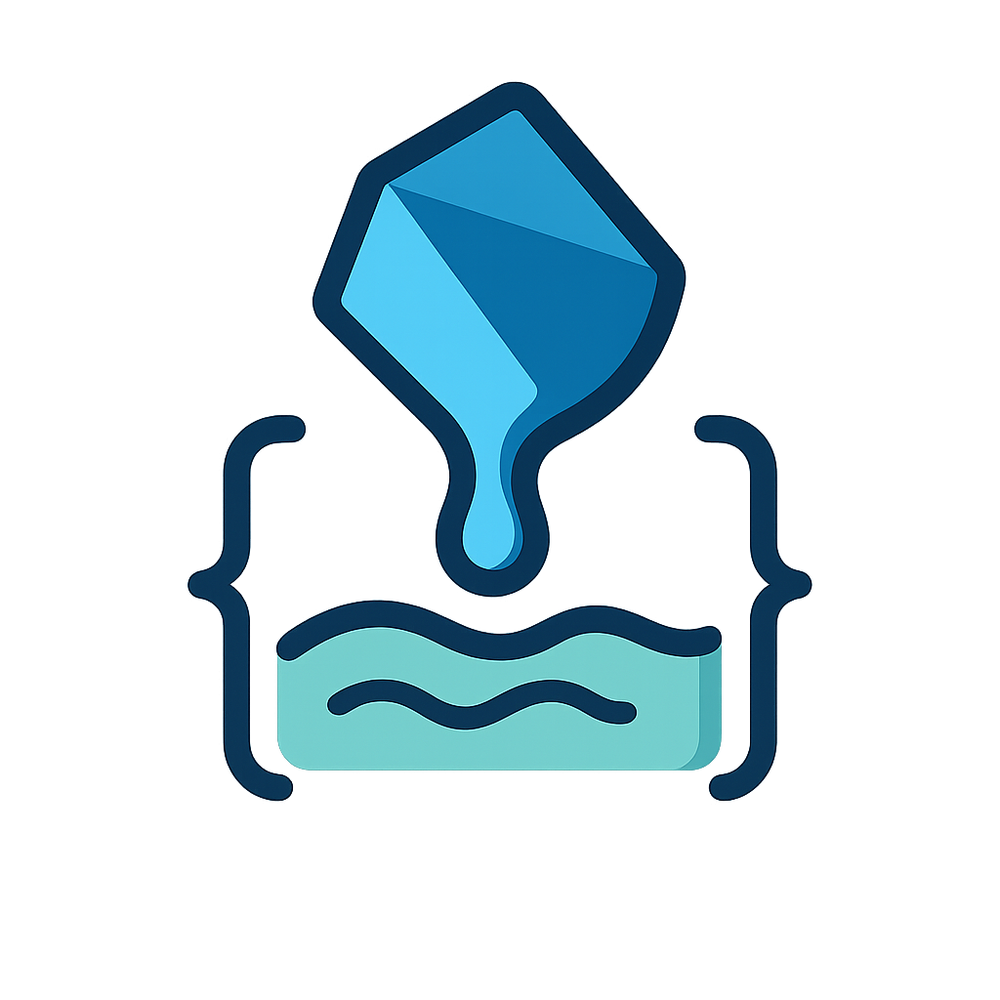

# Liquify - Liquid Template Engine for Dart

<p align="center">
  
</p>

[](https://github.com/kingwill101/liquify/releases/)
[](https://pub.dev/packages/liquify)

[](#license)
[](https://github.com/kingwill101/liquify/issues)


Liquify is a comprehensive Dart implementation of the Liquid template language, originally created by Shopify. This high-performance library allows you to parse, render, and extend Liquid templates in your Dart and Flutter applications.

## Features

- Full support for standard Liquid syntax and semantics
- Synchronous and asynchronous rendering
- **🔒 Environment-scoped filters and tags** for security and isolation
- **🛡️ Strict mode** for security sandboxing (blocks global registry access)
- **⚡ Template-level customization** via environment setup callbacks
- Extensible architecture for custom tags and filters (both sync and async)
- High-performance parsing and rendering
- Strong typing and null safety
- Comprehensive error handling and reporting
- Support for complex data structures and nested objects
- Easy integration with Dart and Flutter projects
- Extensive set of built-in filters ported from LiquidJS
- File system abstraction for template resolution
- Environment cloning for inheritance patterns

## Installation

Add Liquify to your package's `pubspec.yaml` file:

```yaml
dependencies:
  liquify: ^1.3.2
```

Or, for the latest development version:

```yaml
dependencies:
  liquify:
    git: https://github.com/kingwill101/liquify.git
```

Then run `dart pub get` or `flutter pub get` to install the package.

## Usage

For detailed usage examples, please refer to the [example directory](example) in the repository. Here are some basic usage scenarios:

### Basic Template Rendering

Templates can be rendered both synchronously and asynchronously:

```dart
import 'package:liquify/liquify.dart';

void main() async {
  final data = {
    'name': 'Alice',
    'items': ['apple', 'banana', 'cherry']
  };

  final template = Template.parse(
    'Hello, {{ name | upcase }}! Your items are: {{ item }}, .',
    data: data
  );
  
  // Synchronous rendering
  final syncResult = template.render();
  print(syncResult);
  // Output: Hello, ALICE! Your items are: apple, banana, cherry.

  // Asynchronous rendering (useful for async filters or includes)
  final asyncResult = await template.renderAsync();
  print(asyncResult);
  // Output: Hello, ALICE! Your items are: apple, banana, cherry.
}
```

You can also update the template context between renders:

```dart
final template = Template.parse('{{ greeting }} {{ name }}!');

// Update context
template.updateContext({
  'greeting': 'Hello',
  'name': 'World'
});

print(await template.renderAsync()); // "Hello World!"

// Update context again
template.updateContext({'greeting': 'Goodbye'});
print(await template.renderAsync()); // "Goodbye World!"
```

### Secure Template Rendering with Environment Scoping

For applications requiring security isolation or multi-tenancy:

```dart
// Create a secure template with custom filters
final secureTemplate = Template.parse(
  'Welcome {{ username | sanitize }}! You have {{ messages | size }} messages.',
  data: {'username': '<script>alert("xss")</script>John', 'messages': ['msg1', 'msg2']},
  environmentSetup: (env) {
    // Register only safe, sanitized filters
    env.registerLocalFilter('sanitize', (value, args, namedArgs) => 
      value.toString().replaceAll(RegExp(r'[<>]'), ''));
    env.registerLocalFilter('size', (value, args, namedArgs) => 
      (value as List).length);
  },
);

print(await secureTemplate.renderAsync());
// Output: Welcome scriptalert("xss")John! You have 2 messages.
```

### Layout Support

Liquify provides powerful template inheritance through the `layout` tag, allowing you to create reusable base templates and override specific sections using blocks. This feature is particularly useful for maintaining consistent page structures while allowing customization of specific sections.

#### Basic Layout Usage

Here's a simple example of using layouts:

```liquid
// layouts/base.liquid
<!DOCTYPE html>
<html>
<head>
  <title>Default Title</title>
</head>
<body>
  Default content
</body>
</html>
```

```liquid
// page.liquid

My Page Title

  <h1>Welcome to my page!</h1>
  <p>This is custom content.</p>

```

#### Passing Variables to Layouts

You can pass variables from your template to the layout:

```liquid


```

#### Multiple Named Blocks

Layouts can define multiple named blocks that can be selectively overridden:

```liquid
// layouts/post.liquid



  <meta name="author" content="{{ post.author }}">



  <article>
    <h1>{{ post.title }}</h1>
    
  </article>

```

```liquid
// blog-post.liquid


  {{ post.body }}

```

#### Default Block Contents

Blocks in layouts can include default content that will be used if not overridden:

```liquid

  <footer>&copy; {{ year }} Default Footer</footer>

```

For more complex layout examples and advanced usage, please refer to the [example directory](example) in the repository.

### File System and Template Resolution

Liquify provides flexible ways to resolve and load templates from various sources. The `Root` class is the base for implementing template resolution strategies.

#### Using MapRoot for In-Memory Templates

`MapRoot` is a simple implementation of `Root` that stores templates in memory:

```dart
import 'package:liquify/liquify.dart';

void main() {
  final fs = MapRoot({
    'resume.liquid': '''
Name: {{ name }}
Skills: {{ skills | join: ", " }}

''',
    'greeting.liquid': '{{ greeting }}, {{ name }}!',
  });

  final context = {
    'name': 'Alice Johnson',
    'skills': ['Dart', 'Flutter', 'Liquid'],
  };

  final template = Template.fromFile('resume.liquid', fs, data: context);
  print(template.render());
}
```

#### Custom Template Resolution

For more complex scenarios, such as loading templates from a file system or a database, you can create a custom subclass of `Root`:

```dart
class FileSystemRoot extends Root {
  final String basePath;

  FileSystemRoot(this.basePath);
  
  @override
  String? resolve(String path) {
    final file = File('$basePath/$path');
    if (file.existsSync()) {
      return file.readAsStringSync();
    }
    return null;
  }
}

void main() async {
  final fs = FileSystemRoot('/path/to/templates');
  final template = Template.fromFile('resume.liquid', fs, data: context);
  
  // Sync rendering
  print(template.render());
  
  // Async rendering (recommended for templates with includes or async filters)
  print(await template.renderAsync());
}

// Example with async template resolution
class AsyncFileSystemRoot extends Root {
  final String basePath;

  AsyncFileSystemRoot(this.basePath);
  
  @override
  Future<String?> resolveAsync(String path) async {
    final file = File('$basePath/$path');
    if (await file.exists()) {
      return await file.readAsString();
    }
    return null;
  }
}
```

The async support is particularly useful when:
- Loading templates from remote sources
- Using async filters or tags
- Processing large templates with many includes
- Implementing database-backed template storage

This approach allows you to implement custom logic for resolving and loading templates from any source, such as a file system, database, or network resource.

The `render` tag uses this resolution mechanism to include and render other templates, allowing for modular and reusable template structures.

### Environment-Scoped Registry (Advanced Security & Isolation)

Liquify provides powerful environment-scoped filters and tags that allow you to create isolated template execution contexts. This feature is particularly useful for multi-tenant applications, security sandboxing, and plugin systems.

#### Basic Environment Usage

```dart
import 'package:liquify/liquify.dart';

void main() async {
  // Template with environment setup callback
  final template = Template.parse(
    'Hello {{ name | emphasize }}! ',
    data: {'name': 'World'},
    environmentSetup: (env) {
      // Register custom filters and tags for this template only
      env.registerLocalFilter('emphasize', (value, args, namedArgs) => 
        '***${value.toString().toUpperCase()}***');
      env.registerLocalTag('custom_greeting', (content, filters) => 
        CustomGreetingTag(content, filters));
    },
  );

  print(await template.renderAsync());
  // Output: Hello ***WORLD***! 🎉 Welcome! 🎉
}
```

#### Security Sandboxing with Strict Mode

```dart
void main() async {
  // Create a secure environment that blocks global registry access
  final secureEnv = Environment.withStrictMode();
  
  // Only register safe, sanitized filters
  secureEnv.registerLocalFilter('sanitize', (value, args, namedArgs) {
    return value.toString()
      .replaceAll(RegExp(r'<[^>]*>'), '') // Remove HTML tags
      .replaceAll(RegExp(r'[<>"\']'), ''); // Remove dangerous characters
  });
  
  secureEnv.registerLocalFilter('truncate', (value, args, namedArgs) {
    final maxLen = args.isNotEmpty ? args[0] as int : 50;
    final str = value.toString();
    return str.length > maxLen ? '${str.substring(0, maxLen)}...' : str;
  });

  final secureTemplate = Template.parse(
    'Safe content: {{ userInput | sanitize | truncate: 20 }}',
    data: {'userInput': '<script>alert("XSS")</script>This is user input'},
    environment: secureEnv,
  );

  print(await secureTemplate.renderAsync());
  // Output: Safe content: scriptalert("XSS")Th...
  
  // Attempting to use global filters will return null in strict mode
  print(secureEnv.getFilter('dangerous_global_filter')); // null
}
```

#### Environment Isolation Between Templates

```dart
void main() async {
  // Template A with specific formatting
  final templateA = Template.parse(
    'Result: {{ value | format }}',
    data: {'value': 'test'},
    environmentSetup: (env) {
      env.registerLocalFilter('format', (value, args, namedArgs) => 
        'TEMPLATE_A_FORMAT:$value');
    },
  );

  // Template B with different formatting
  final templateB = Template.parse(
    'Result: {{ value | format }}',
    data: {'value': 'test'},
    environmentSetup: (env) {
      env.registerLocalFilter('format', (value, args, namedArgs) => 
        'TEMPLATE_B_FORMAT:$value');
    },
  );

  print(await templateA.renderAsync()); // Result: TEMPLATE_A_FORMAT:test
  print(await templateB.renderAsync()); // Result: TEMPLATE_B_FORMAT:test
}
```

#### Environment Cloning and Inheritance

```dart
void main() async {
  // Create a base environment with common filters
  final baseEnv = Environment();
  baseEnv.registerLocalFilter('base_format', (value, args, namedArgs) => 
    'BASE:$value');
  baseEnv.registerLocalTag('base_tag', (content, filters) => 
    BaseTag(content, filters));

  // Clone and extend for specific use cases
  final childEnv = baseEnv.clone();
  childEnv.registerLocalFilter('child_format', (value, args, namedArgs) => 
    'CHILD:$value');
  childEnv.registerLocalTag('child_tag', (content, filters) => 
    ChildTag(content, filters));

  final template = Template.parse(
    '''
    Base: {{ text | base_format }}
    Child: {{ text | child_format }}
    
    ''',
    data: {'text': 'test'},
    environment: childEnv,
  );

  print(await template.renderAsync());
  // Output:
  // Base: BASE:test
  // Child: CHILD:test
  // [BASE_TAG][CHILD_TAG]
}
```

#### Dynamic Environment Modification

```dart
void main() async {
  final template = Template.parse(
    'Filtered: {{ message | transform }}',
    data: {'message': 'hello'},
  );

  // Register initial filter
  template.environment.registerLocalFilter('transform', (value, args, namedArgs) => 
    'INITIAL:$value');

  print(await template.renderAsync()); // Filtered: INITIAL:hello

  // Dynamically change the filter behavior
  template.environment.registerLocalFilter('transform', (value, args, namedArgs) => 
    'UPDATED:$value');

  print(await template.renderAsync()); // Filtered: UPDATED:hello
}
```

#### Use Cases for Environment-Scoped Registry

1. **Multi-tenant Applications**: Each tenant gets their own isolated environment
2. **Security Sandboxing**: Restrict template capabilities for untrusted content
3. **Plugin Systems**: Plugins can register their own filters/tags without conflicts
4. **API Versioning**: Different API versions with different template capabilities
5. **Theme Systems**: Different themes with custom visual filters
6. **Content Management**: Different content types with specialized processing

#### Priority System

The environment-scoped registry follows a clear priority system:

1. **Local filters/tags** (registered via `registerLocalFilter`/`registerLocalTag`)
2. **Global filters/tags** (registered via `FilterRegistry.register`/`TagRegistry.register`)
3. **Strict mode** blocks access to global registries entirely

This ensures predictable behavior while maintaining flexibility.

### Custom Tags and Filters

Liquify allows you to create custom tags and filters. For detailed examples, please refer to the [example directory](example) in the repository.

## API Documentation

Detailed API documentation is available [here](https://pub.dev/documentation/liquify/latest/).

## Contributing

Contributions are welcome! Please feel free to submit a Pull Request. For major changes, please open an issue first to discuss what you would like to change.

## License

This project is licensed under the [MIT License](LICENSE).

## Acknowledgements

- Shopify for the original Liquid template language
- The Dart team for the excellent language and tools
- [LiquidJS](https://github.com/harttle/liquidjs) for their comprehensive set of filters, which we've ported to Dart
- [liquid_dart](https://github.com/ergonlabs/liquid_dart) for their initial Dart implementation, which served as inspiration for this project

## Related Projects

- [LiquidJS](https://github.com/harttle/liquidjs): A popular JavaScript implementation of Liquid templates
- [liquid_dart](https://github.com/ergonlabs/liquid_dart): An earlier Dart implementation of Liquid templates (now unmaintained)

Liquify aims to provide a modern, maintained, and feature-rich Liquid template engine for the Dart ecosystem, building upon the work of these excellent projects.
